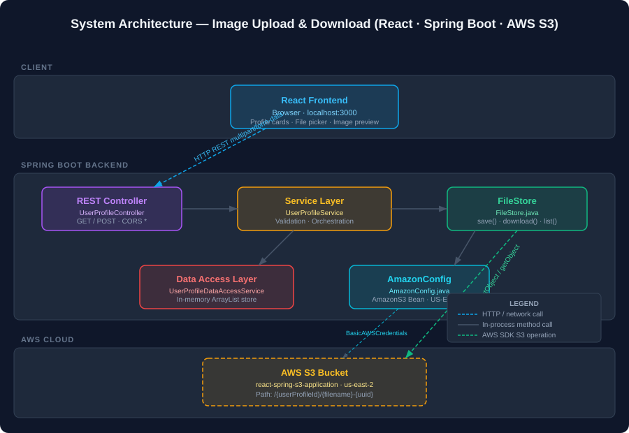

# Image Upload & Download — React · Spring Boot · AWS S3

Upload and download image files stored in Amazon S3, served through a Spring Boot REST API with a React frontend.

> **Setup required:** Populate `AmazonConfig.java` with your AWS Access Key and Secret Key before running.

---

## Architecture



| Layer | Technology | Responsibility |
|-------|-----------|---------------|
| Client | React (Browser) | Profile cards, file picker, image preview |
| REST Controller | Spring Boot `UserProfileController` | Route HTTP requests, CORS (`*`) |
| Service | `UserProfileService` | Validation, orchestration |
| File I/O | `FileStore` | S3 `putObject` / `getObject` / `listObjectsV2` |
| Data Access | `UserProfileDataAccessService` | In-memory `ArrayList` store |
| Config | `AmazonConfig` | `AmazonS3` bean, region `us-east-2` |
| Storage | AWS S3 | Binary objects at `/{userProfileId}/{filename}-{uuid}` |

---

## API Reference

Base URL: `http://localhost:8080/api/v1/user-profile`

### GET `/api/v1/user-profile`

Fetch all user profiles.

**Response `200 OK`**
```json
[
  {
    "userProfileId": "061baf4e-2569-412d-9062-17b25e21047a",
    "username": "skushal746",
    "userProfileImageLink": "avatar-3f9a1c.jpeg",
    "userDescription": "This user is simply awesome..."
  }
]
```

---

### POST `/api/v1/user-profile/{userProfileId}/image/upload`

Upload a profile image for a user.

| Parameter | Location | Type | Required | Notes |
|-----------|----------|------|----------|-------|
| `userProfileId` | Path | UUID | Yes | Must exist in the data store |
| `file` | Form-data | MultipartFile | Yes | JPEG, PNG, or GIF; max 10 MB |

**Response `200 OK`** — empty body on success

**Error conditions**
- `400 Bad Request` — file is empty
- `400 Bad Request` — file MIME type is not `image/*`
- `400 Bad Request` — `userProfileId` not found

---

### GET `/api/v1/user-profile/{userProfileId}/image/download`

Download the first stored profile image for a user.

| Parameter | Location | Type | Required |
|-----------|----------|------|----------|
| `userProfileId` | Path | UUID | Yes |

**Response `200 OK`** — `byte[]` (binary image data)
Returns empty byte array if no image has been uploaded yet.

---

## OpenAPI Schema

```yaml
openapi: "3.0.3"
info:
  title: "Image Upload & Download API"
  description: "REST API for user profile image management via AWS S3"
  version: "1.0.0"
servers:
  - url: "http://localhost:8080"
    description: "Local development"

paths:
  /api/v1/user-profile:
    get:
      summary: "List all user profiles"
      operationId: "getAllUserProfiles"
      tags: ["UserProfile"]
      responses:
        "200":
          description: "Array of user profiles"
          content:
            application/json:
              schema:
                type: array
                items:
                  $ref: "#/components/schemas/UserProfile"

  /api/v1/user-profile/{userProfileId}/image/upload:
    post:
      summary: "Upload profile image"
      operationId: "uploadUserProfileImage"
      tags: ["UserProfile"]
      parameters:
        - name: userProfileId
          in: path
          required: true
          schema:
            type: string
            format: uuid
      requestBody:
        required: true
        content:
          multipart/form-data:
            schema:
              type: object
              properties:
                file:
                  type: string
                  format: binary
      responses:
        "200":
          description: "Image uploaded successfully"
        "400":
          description: "Validation error (empty file, wrong type, unknown user)"

  /api/v1/user-profile/{userProfileId}/image/download:
    get:
      summary: "Download profile image"
      operationId: "downloadUserProfileImage"
      tags: ["UserProfile"]
      parameters:
        - name: userProfileId
          in: path
          required: true
          schema:
            type: string
            format: uuid
      responses:
        "200":
          description: "Binary image data"
          content:
            application/octet-stream:
              schema:
                type: string
                format: binary

components:
  schemas:
    UserProfile:
      type: object
      properties:
        userProfileId:
          type: string
          format: uuid
          example: "061baf4e-2569-412d-9062-17b25e21047a"
        username:
          type: string
          example: "skushal746"
        userProfileImageLink:
          type: string
          nullable: true
          example: "avatar-3f9a1c.jpeg"
        userDescription:
          type: string
          example: "This user is simply awesome..."
```

---

## Project Metadata

```json
{
  "project": {
    "name": "ImageUploadandDownload-ReactSpringS3Application",
    "version": "1.0.0",
    "status": "proof-of-concept",
    "created": "2022",
    "language": "Java 17",
    "framework": "Spring Boot 2.7.0-SNAPSHOT",
    "build": "Maven (mvnw wrapper)"
  },
  "infrastructure": {
    "cloud": "AWS",
    "region": "us-east-2",
    "services": ["S3"],
    "bucket": "react-spring-s3-application",
    "s3PathTemplate": "/{userProfileId}/{originalFilename}-{uuid}"
  },
  "api": {
    "baseUrl": "/api/v1/user-profile",
    "protocol": "REST / HTTP",
    "authentication": "none",
    "cors": "all origins (*)",
    "maxFileSize": "10MB",
    "supportedMimeTypes": ["image/jpeg", "image/png", "image/gif"]
  },
  "dataStore": {
    "type": "in-memory",
    "class": "FakeUserProfileDataStore",
    "persistence": false,
    "seedUsers": 2
  },
  "frontend": {
    "framework": "React (planned)",
    "directory": "src/main/frontend",
    "status": "not yet implemented"
  }
}
```

---

## Architecture Decision Records

### ADR-001 — In-Memory Data Store over a Database

**Status:** Accepted (proof-of-concept scope)

**Context:** The application needs to track user profiles and their associated S3 image links. A real database (PostgreSQL, MySQL) would require additional infrastructure setup.

**Decision:** Use a hardcoded in-memory `ArrayList` (`FakeUserProfileDataStore`) populated at startup via `@PostConstruct`.

**Consequences:**
- (+) Zero infrastructure dependencies — run with `mvn spring-boot:run`
- (+) Fast development iteration
- (-) All data is lost on restart
- (-) Not suitable for production or multi-instance deployment
- **Migration path:** Replace `UserProfileDataAccessService` with a Spring Data JPA repository backed by PostgreSQL

---

### ADR-002 — AWS SDK v1 over SDK v2

**Status:** Accepted

**Context:** The project uses `aws-java-sdk` version `1.12.131` (v1), not the newer AWS SDK for Java v2.

**Decision:** Retain SDK v1 for compatibility with existing Spring Boot 2.7 configuration patterns.

**Consequences:**
- (+) Well-documented; large number of Stack Overflow examples
- (-) AWS SDK v1 is in maintenance mode; v2 offers async clients and better performance
- **Migration path:** Replace `AmazonS3` with `software.amazon.awssdk.services.s3.S3Client` (v2)

---

### ADR-003 — Hardcoded Credentials over Environment Variables

**Status:** Accepted (development only) — must change before any deployment

**Context:** `AmazonConfig.java` uses `BasicAWSCredentials("", "")` with placeholder empty strings.

**Decision:** Accept hardcoded placeholders for local dev; credentials must be externalized before deployment.

**Consequences:**
- (-) Secret leakage risk if strings are populated and committed to git
- **Required action:** Use `EnvironmentVariableCredentialsProvider` or `~/.aws/credentials` via `DefaultAWSCredentialsProviderChain`

---

### ADR-004 — CORS Open to All Origins

**Status:** Accepted (development only)

**Context:** `@CrossOrigin("*")` is applied to `UserProfileController` to allow the React dev server (typically `localhost:3000`) to call the API.

**Decision:** Wildcard CORS for developer convenience.

**Consequences:**
- (-) Security risk in any public-facing deployment
- **Required action:** Restrict to specific allowed origins via `WebMvcConfigurer` before production

---

## Getting Started

### Prerequisites
- Java 17
- Maven (or use the included `./mvnw` wrapper)
- AWS account with an S3 bucket named `react-spring-s3-application` in `us-east-2`

### Configuration

Open `src/main/java/com/react/spring/ReactSpringS3Application/config/AmazonConfig.java` and fill in your credentials:

```java
AWSCredentials awsCredentials = new BasicAWSCredentials(
    "YOUR_ACCESS_KEY_ID",
    "YOUR_SECRET_ACCESS_KEY"
);
```

> For production, use `DefaultAWSCredentialsProviderChain` instead of hardcoded keys.

### Run

```bash
./mvnw spring-boot:run
```

API available at `http://localhost:8080`

### Build JAR

```bash
./mvnw clean package
java -jar target/*.jar
```

---

## Project Structure

```
src/main/java/com/react/spring/ReactSpringS3Application/
├── Main.java                          # @SpringBootApplication entry point
├── config/
│   └── AmazonConfig.java              # AmazonS3 bean, credentials, region
├── bucket/
│   └── BucketName.java                # Enum: S3 bucket name constant
├── datastore/
│   └── FakeUserProfileDataStore.java  # In-memory seed data + @PostConstruct S3 sync
├── filestore/
│   └── FileStore.java                 # save() / download() / list() against S3
└── profile/
    ├── UserProfile.java               # Domain model (UUID, username, imageLink, description)
    ├── UserProfileController.java     # REST endpoints, @CrossOrigin
    ├── UserProfileService.java        # Business logic + validation
    └── UserProfileDataAccessService.java  # Data access (wraps FakeUserProfileDataStore)

assets/
├── architecture-diagram.svg           # System architecture visual
└── load-testing-graph.svg             # Latency & throughput charts
```
